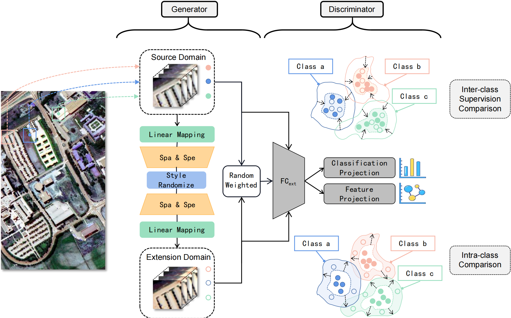

# Locally Linear Embedding Unbiased Domain Randomization Networks for Cross-Scene Hyperspectral Image Classification

<p align='center'>
  
</p>

## Abstract

Unseen target domain is often inevitable, especially for hyperspectral applications processed offline on edge devices, so models can only be trained on source domain and directly applied to target domain. For cross-scene hyperspectral image classification, generalization from single-source domain to out-of-distribution is both practical and challenging. One feasible idea is to calculate potential values for performing domain expansion, and optimize discriminator to learn domain-invariant representation. First, for domain extension, this paper proposes a space-spectrum generation network, which consists of linear mapping and 3D convolutions to implicitly learn spectral principal components and space-spectrum local feature encoding. The extended domain is generated by random style transfer. In particular, intra-class supervision learning is employed to prevent the extended domain from overlapping with the source. Then, for the discriminator, this paper designs a classification network based on 2D convolution. Considering decision boundary in low-density area benifits generalization in Cluster Assumption, an inter-class supervision comparison penalty item is embedded in optimization step. Extensive experiments on two public HSI datasets demonstrate the superiority of the proposed method when compared with state-of-the-art techniques.

## Requirements

CUDA Version: 11.7

torch: 2.0.0

Python: 3.10

## Dataset

The dataset directory should look like this:

```bash
datasets
├── Houston
│   ├── Houston13.mat
│   ├── Houston13_7gt.mat
│   ├── Houston18.mat
│   └── Houston18_7gt.mat
└── Pavia
    ├── paviaC.mat
    └── paviaC_7gt.mat
    ├── paviaU.mat
    └── paviaU_7gt.mat

```

## Usage

1.You can download [Houston &amp; Pavia](https://drive.google.com/drive/folders/1No-DNDT9P1HKsM9QKKJJzat8A1ZhVmmz?usp=drive_link) dataset here.

2.You can change the `source_name` and `target_name` in train.py to set different transfer tasks.

3.Run the following command:

Houston dataset:
```
python train.py --data_path ./datasets/Houston/ --source_name Houston13 --target_name Houston18 --re_ratio 5 --training_sample_ratio 0.8 --dim1 128 --dim2 8 --lambda_1 1.0 --lambda_2 1.0
```
Pavia dataset:
```
python train.py --data_path ./datasets/Pavia/ --source_name paviaU --target_name paviaC --re_ratio 1 --training_sample_ratio 0.8 --dim1 8 --dim2 16 --lambda_1 1.0 --lambda_2 1.0
```

## Note

- The variable names of data and gt in .mat file are set as `ori_data` and `map`.
- For Pavia dataset and Houston dataset, args.re_ratio is set to 1 and 5, respectively
