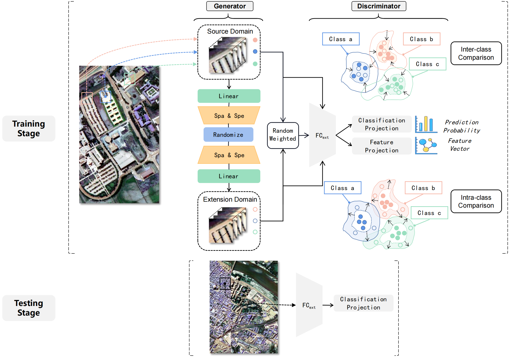

# Locally Linear Unbiased Randomization Network for Cross-Scene Hyperspectral Image Classification

<p align='center'>
  
</p>

## Abstract

For hyperspectral cross-domain recognition applications, the unseen target domain is inevitable, and the model can only be trained on the source domain but directly applied to unknown domains. A major challenge of this domain generalization problem comes from the domain shift caused by differences in environments, devices, etc. One feasible strategy is performing domain expansion with latent variables and learning domain-invariant representation. Inspired by this framework, the study proposes a generation network for extension, which consists of symmetric encoder-decoder to implicitly build local joint feature under style randomization. Moreover, supervised contrastive learning is employed to avoid duplicate augmentation. Besides, considering the trade-off between domain-specific and domain-invariant, an adversarial penalty term is formed by inter-class and intra-class contrastive regularization in the discriminator. Multiple evaluations on three public HSI datasets indicate that proposed method outperforms state-of-the-art approaches. 

## Paper

Please cite our paper if you find the code or dataset useful for your research.

```
@ARTICLE{10268956,
  author={Zhao, Hanqing and Zhang, Jiawei and Lin, Lianlei and Wang, Junkai and Gao, Sheng and Zhang, Zongwei},
  journal={IEEE Transactions on Geoscience and Remote Sensing}, 
  title={Locally Linear Unbiased Randomization Network for Cross-Scene Hyperspectral Image Classification}, 
  year={2023},
  volume={},
  number={},
  pages={1-1},
  doi={10.1109/TGRS.2023.3321347}}

```


## Requirements

CUDA Version: 11.7

torch: 2.0.0

Python: 3.10

## Dataset

The dataset directory should look like this:

```bash
datasets
├── Houston
│   ├── Houston13.mat
│   ├── Houston13_7gt.mat
│   ├── Houston18.mat
│   └── Houston18_7gt.mat
└── Pavia
    ├── paviaC.mat
    └── paviaC_7gt.mat
    ├── paviaU.mat
    └── paviaU_7gt.mat

```

## Usage

1.You can download [Houston &amp; Pavia](https://drive.google.com/drive/folders/1No-DNDT9P1HKsM9QKKJJzat8A1ZhVmmz?usp=sharing) dataset here.

2.You can change the `source_name` and `target_name` in train.py to set different transfer tasks.

3.Run the following command:

Houston dataset:
```
python train.py --data_path ./datasets/Houston/ --source_name Houston13 --target_name Houston18 --re_ratio 5 --training_sample_ratio 0.8 --dim1 128 --dim2 8 --lambda_1 1.0 --lambda_2 1.0
```
Pavia dataset:
```
python train.py --data_path ./datasets/Pavia/ --source_name paviaU --target_name paviaC --re_ratio 1 --training_sample_ratio 0.8 --dim1 8 --dim2 16 --lambda_1 1.0 --lambda_2 1.0
```

## Note

- The variable names of data and gt in .mat file are set as `ori_data` and `map`.
